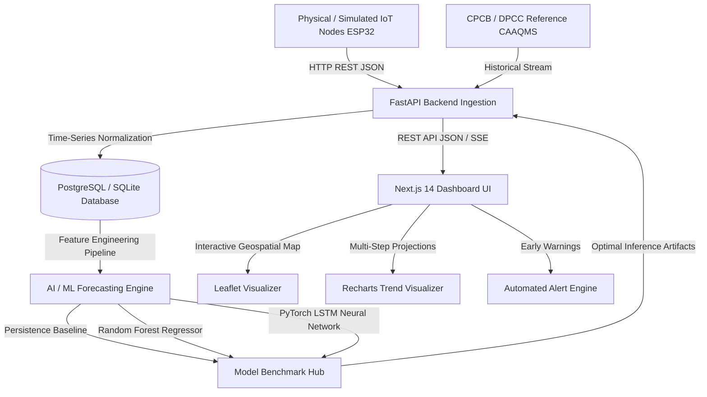

# AeroGuard Technical Architecture

## 1. System Overview
AeroGuard is designed as a **Complementary AIoT Intelligence Layer** that interfaces with official Continuous Ambient Air Quality Monitoring Stations (CAAQMS) and distributed low-cost IoT edge sensor nodes.

## 2. Core Architectural Components

### 2.1 Edge & Ingestion Layer
- **Hardware**: ESP32 microcontroller with Plantower PMS5003 laser particulate sensor, DHT22 ambient temperature/humidity sensor, and MQ-135 multi-gas sensor.
- **Protocol**: HTTP/HTTPS REST (`POST /api/sensors/data`) using structured JSON with range validation.
- **Simulation**: High-fidelity Python simulator (`iot/simulator/simulator.py`) replicating multi-node spatial distributions and diurnal curves across Delhi NCR.

### 2.2 Data Ingestion & Validation Pipeline
- **Physical Bounds Filtering**: Strict scientific range limits preventing corrupted or physically impossible readings from polluting the database.
- **Controlled Time-Aware Interpolation**: Bounded linear interpolation restricted to continuous gaps $\le 1$ hour.
- **Rolling Multi-Window Averaging**: 24-hour rolling averages for $\text{PM}_{2.5}$, $\text{PM}_{10}$, $\text{NO}_2$, $\text{SO}_2$, $\text{NH}_3$, and 8-hour rolling averages for $\text{CO}$ and $\text{O}_3$ to strictly comply with Indian CPCB sub-index requirements.

### 2.3 AI / Machine Learning Engine
- **Persistence Baseline**: Naive reference point for regression benchmark.
- **Random Forest**: Tuned ensemble regressor leveraging diurnal cyclical encodings, multi-lag memory ($t-1, t-2, t-4, t-16, t-96$), and rolling statistical aggregates.
- **PyTorch LSTM**: Deep recurrent sequence model with dropout regularization for multi-step temporal dependencies.
- **Empirical Validation**: Strict chronological 80/20 train-test split avoiding future leakage.

### 2.4 Database Layer
- **PostgreSQL 14+ / 18**: Tables for `stations`, `sensors`, `air_quality_records`, `predictions`, `alerts`, `hotspots`, and `model_metrics`.
- **SQLAlchemy 2.0 ORM**: Clean abstraction with seamless SQLite fallback.

### 2.5 Presentation Layer (Next.js & Tailwind CSS)
- Fully responsive, accessible, government/environmental-grade UI.
- Live AQI gauge, actual vs. predicted charts, Leaflet interactive geospatial map, active hotspot matrix, stoichiometric source-pattern analysis, and CPCB health advisories.
